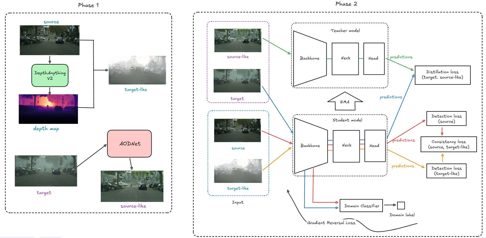

# FusionDA — Enhancing Object Detection under Foggy Conditions through Fusion Domain Adaptation

> **Bachelor thesis project · University of Engineering and Technology, VNU Hanoi**
> Nguyen Duc Khanh (22028196) — Supervised by Dr. Nguyen Duc Anh, M.Sc. Pham Duc Anh
> Full report: [📄 Google Drive folder](https://drive.google.com/drive/folders/1oGmdsR8ylqiAGYIo6MRvbcsjThwuXjNK?usp=sharing)

---

## Abstract

Outdoor object detectors trained on clear-weather data degrade severely when deployed in fog: light is scattered and absorbed along its path, contrast collapses, and the labelled source distribution stops resembling what the model actually sees in production. FusionDA tackles this *domain shift* without ever requiring labels on the target (foggy) side. The method is built on top of [Ultralytics YOLO26-s](https://docs.ultralytics.com/models/yolo26/) and combines three ideas:

1. **Physics-based cross-domain image generation.** Rather than relying on adversarially trained translators (CycleGAN / CUT), we synthesise the missing styles deterministically. A monocular depth network ([Depth-Anything-V2](https://github.com/khasnhmissu/Depth-Anything-V2)) provides per-pixel depth, which is plugged into the atmospheric scattering model to render every clear source image as a foggy *target-like* view. In the opposite direction, [AOD-Net](https://github.com/khasnhmissu/AOD-Net) dehazes each foggy target image into a clear *source-like* view.
2. **Mean-Teacher knowledge distillation.** A teacher network — built by EMA over the student weights — is fed *source-like* (dehazed target) images and produces high-recall pseudo-labels through the dense `one2many` head. The student then learns from those pseudo-labels on the matching real target images, importing target-side instance knowledge that no labelled set could provide.
3. **Feature-level alignment.** A consistency loss enforces agreement between the student's features on the (source, target-like) pair, while a Gradient-Reversal-Layer (DANN) discriminator pushes the backbone toward domain-invariant representations on the (source, target) pair.

Trained and evaluated on Cityscapes ⟶ Foggy-Cityscapes (person + car), the resulting teacher reaches **mAP@50 = ... / mAP@50–95 = ...** on the foggy validation split — a +... mAP@50 improvement over a YOLO26-s baseline trained on the source labels alone (see Section 4 of the report for the full ablation).

---

## 1.  Method overview

<p align="center">
  
</p>

- **Phase 1 — Image generation.** Depth-Anything-V2 turns each clear source image into a foggy *target-like* view; AOD-Net dehazes each foggy target image into a clear *source-like* view.
- **Phase 2 — Training.** YOLO26-s is trained as a Mean-Teacher pair: the student learns from labels on the source side and from teacher pseudo-labels on the target side, with a consistency loss across the (source, target-like) pair and a GRL domain classifier on top.

See report §3 for the detailed formulation of every loss term and training schedule.

---

## 2.  Quick start

### 2.1  Environment & data

```bash
git clone <this-repo> && cd FusionDA
bash scripts/setup_env.sh        # venv + PyTorch (CUDA 11.8) + datasets + YOLO26-s weights
source venv/bin/activate
```

`setup_env.sh` provisions the following layout:

```
datasets/
├── source_real/source_real/{train,val}/{images,labels}     # Cityscapes (clear)
├── source_fake/source_fake/{train,val}/{images,labels}     # target-like (Phase 1, DepthAnythingV2 + ASM)
├── target_real/target_real/{train,val}/{images,labels}     # Foggy-Cityscapes
└── target_fake/target_fake/{train,val}/{images,labels}     # source-like (Phase 1, AOD-Net)
```

(The `_fake` directories are the Phase-1 outputs of [Depth-Anything-V2](https://github.com/khasnhmissu/Depth-Anything-V2) and [AOD-Net](https://github.com/khasnhmissu/AOD-Net) — clone those two repos and follow their READMEs to regenerate the synthetic pairs from scratch.)

### 2.2  Reproduce the latest 5-variant ablation

```bash
bash scripts/run_all_ablations.sh
```

This launches the same five training runs that produced the numbers reported in the thesis and prints a summary table at the end. To run a single variant:

```bash
bash scripts/01_baseline.sh                       # pure detection, no DA
bash scripts/02_teacher_only.sh                   # pseudo-label distillation, no source_fake
bash scripts/03_source_fake_no_consistency.sh     # +source_fake, no consistency loss
bash scripts/04_consistency.sh                    # default FDA (no GRL)
bash scripts/05_grl.sh                            # full FDA + GRL
```

Each script writes weights, debug images and logs to `runs/ablation/<name>/`.

### 2.3  Inference & evaluation

```bash
# YOLO-format .txt predictions per image
python inference.py \
  --weights yolo26s.pt \
  --checkpoint runs/ablation/05_grl/weights/best.pt \
  --source     datasets/target_real/target_real/val/images \
  --output     predicts/05_grl

# COCO-style mAP via Ultralytics
python yolo26eval.py \
  --weights runs/ablation/05_grl/weights/best.pt \
  --data    configs/data/data.yaml --split test
```

Use `inference_base.py` if your checkpoint is an Ultralytics full-module dump rather than a raw state-dict.

---

## 3.  References & related repositories

- **Thesis (full report)** — Nguyen Duc Khanh, *Enhancing Object Detection Performance under Foggy Conditions through Fusion Domain Adaptation*, UET-VNU 2026. [📄 Google Drive folder](https://drive.google.com/drive/folders/1oGmdsR8ylqiAGYIo6MRvbcsjThwuXjNK?usp=sharing) · [`docs/KLTN_NguyenDucKhanh22028196.pdf`](docs/KLTN_NguyenDucKhanh22028196.pdf).
- **Phase-1 image generators (this project's forks):**
  - [khasnhmissu/Depth-Anything-V2](https://github.com/khasnhmissu/Depth-Anything-V2) — monocular depth → atmospheric scattering → *target-like* (foggy) view of a clear source image.
  - [khasnhmissu/AOD-Net](https://github.com/khasnhmissu/AOD-Net) — single-image dehazing network → *source-like* (clear) view of a foggy target image.
- **Baselines compared against FusionDA (this project's forks):**
  - [khasnhmissu/DA-Detect](https://github.com/khasnhmissu/DA-Detect) — Domain-Adaptive Faster R-CNN (Chen et al., CVPR 2018) re-implementation used for cross-domain detection comparison on Cityscapes ⟶ Foggy-Cityscapes.
  - [khasnhmissu/aldi](https://github.com/khasnhmissu/aldi) — ALDI (Align and Distill) baseline run on the same dataset and protocol.
- **Backbone / detection loss** — [Ultralytics YOLO26](https://docs.ultralytics.com/models/yolo26/), `v8DetectionLoss`, `E2ELoss`. Reference paper: [`docs/yolo26_paper.pdf`](docs/yolo26_paper.pdf).
- **Domain-adversarial training** — Ganin & Lempitsky, *Unsupervised Domain Adaptation by Backpropagation*, ICML 2015 (DANN / GRL).
- **Mean Teacher** — Tarvainen & Valpola, *Mean teachers are better role models*, NeurIPS 2017.
- **Atmospheric scattering & dark-channel prior** — He, Sun & Tang, *Single Image Haze Removal Using Dark Channel Prior*, CVPR 2009.
- **Depth-Anything-V2** — Yang et al., 2024 (ViT-L + DPT, fine-tuned on Virtual KITTI 2).
- **AOD-Net** — Li et al., *AOD-Net: All-in-One Dehazing Network*, ICCV 2017.
- **Cityscapes / Foggy-Cityscapes** — Cordts et al. 2016, Sakaridis et al. 2018.
