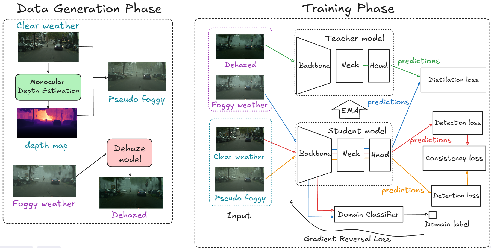

# FusionDA — Enhancing Object Detection Performance under Foggy Conditions through Fusion Domain Adaptation

> **Bachelor's thesis · University of Engineering and Technology, VNU Hanoi**
> Nguyen Duc Khanh (22028196) — Supervised by Dr. Nguyen Duc Anh, M.Sc. Pham Duc Anh
> Full report: [📄 Thesis](src\docs\Nguyen Duc Khanh - ENHANCE OBJECT DETECTION PERFORMANCE FOR FOGGY CONDITIONS THROUGH FUSION DOMAIN ADAPTATION.pdf) · [📁 Google Drive folder](https://drive.google.com/drive/folders/1oGmdsR8ylqiAGYIo6MRvbcsjThwuXjNK?usp=sharing)
> Checkpoints & generated datasets: [byvn.net/VKY1](https://byvn.net/VKY1)

---

## Abstract

Modern object detectors such as YOLO and Faster R-CNN reach high accuracy under clear weather but degrade sharply under fog: atmospheric scattering reduces contrast and shifts the input distribution away from the labelled source domain. **FusionDA** is a semi-supervised domain-adaptation framework that tackles this problem without any label on the foggy (target) side, by combining three complementary mechanisms.

1. **Physics-based cross-domain image generation.** Instead of an adversarial translator (CycleGAN, CUT), FusionDA synthesises the missing styles deterministically. A monocular depth network ([Depth-Anything-V2](https://github.com/khasnhmissu/Depth-Anything-V2)) plugged into the atmospheric scattering model renders every clear source image as a *pseudo-foggy* view. In the opposite direction, [AOD-Net](https://github.com/khasnhmissu/AOD-Net) dehazes each foggy target image into a *dehazed* (clear-like) view. The synthesised images preserve the original scene structure and therefore reuse the source-side annotations directly.
2. **Mean-Teacher knowledge distillation.** A teacher built as an EMA of the student processes the *dehazed* images and emits high-confidence pseudo-labels. The student is then supervised by those pseudo-labels on the matching real foggy images, importing target-side knowledge that no labelled set provides.
3. **Feature-level alignment.** A cosine **consistency loss** enforces agreement between the student's backbone features on each (clear, pseudo-foggy) pair, while a **Gradient-Reversal-Layer (DANN-style) discriminator** with a GAP + MLP head pushes the backbone toward domain-invariant representations on the (clear, foggy) pair.

Trained and evaluated on the standard **Cityscapes ⟶ Foggy Cityscapes** benchmark (classes *person* and *car*) and stress-tested zero-shot on three real-fog test sets (**RTTS**, **Foggy Driving**, **FoggyZurich-test**), FusionDA reaches the highest multi-domain harmonic mean **HM<sub>50</sub><sup>(3)</sup> = 55.37** on YOLO26-l (54.22 on YOLO26-s), surpassing the strongest DAOD baseline (**DA-Detect**, HM = 46.14) by **+17.5% – +20.0%** relative. The improvement is even larger on natural fog: **+24.87 mAP<sub>50</sub> (+77.0% relative) on RTTS** for FusionDA-s, far exceeding the +28.6% gain on synthetic Foggy Cityscapes — strong evidence that FusionDA learns genuinely fog-invariant features rather than overfitting to the synthetic distribution. A supplementary experiment on **WIDERFACE-easy** with `imagecorruptions`-generated fog confirms that the same trend transfers to single-class face detection. Analyses based on Maximum Mean Discrepancy, UMAP visualisation, and C2PSA attention maps further confirm that the domain gap is narrowed at the feature level and that FusionDA avoids the catastrophic forgetting commonly seen in DAOD.

**Keywords:** Object detection · Domain adaptation · Semi-supervised learning · Foggy weather · FusionDA · YOLO26.

---

## 1.  Method overview

<p align="center">
  
</p>

- **Phase 1 — Data generation.** Depth-Anything-V2 turns each clear source image $I_s$ into a pseudo-foggy view $I_{sf}$ via the atmospheric scattering model (scattering coefficient sampled as $\beta \sim \mathcal{U}(0.005, 0.015)$, atmospheric light $A$ estimated by the dark-channel prior). In the reverse direction, AOD-Net produces a dehazed view $I_{tf}$ from each foggy target image $I_t$.
- **Phase 2 — Training.** The student (YOLO26 / YOLOv5m / Faster R-CNN R50-FPN) is trained end-to-end with one total loss that combines: detection on the clear domain, detection on pseudo-foggy images (with progressively decaying weight), Mean-Teacher distillation on foggy images, feature consistency on the (clear, pseudo-foggy) pair, and a GRL domain-adversarial loss. Teacher weights follow an EMA of the student with $\alpha = 0.9999$; pseudo-labels are filtered with confidence threshold $\tau = 0.5$.

See report §3 for the full formulation, §4.2 for the hyperparameters, and §4.4 for the ablation that quantifies the contribution of each component.

---

## 2.  Repository layout

After the recent code reorganisation, all source code lives under `src/`:

```
FusionDA/
├── README.md                  # ← this file
├── references/                # PDF copies of the papers cited in the report
└── src/
    ├── train.py               # main FusionDA trainer (YOLO26 / YOLOv5m)
    ├── train_fasterrcnn.py    # FusionDA on Faster R-CNN (R50-FPN)
    ├── train_yolov5m.py       # FusionDA on YOLOv5m
    ├── fusion_da.py           # losses, EMA, paired multi-domain dataset
    ├── domain_adaptation.py   # GRL discriminator + feature hooks
    ├── yolo26eval.py          # COCO-style mAP evaluation (Ultralytics)
    ├── eval_v5m.py            # YOLOv5m evaluation
    ├── eval_r50fpn.py         # Faster R-CNN evaluation
    ├── fasterrcnn/            # Faster R-CNN model + DA hooks
    ├── utils/                 # FDA helpers, explainability, logger, monitors
    ├── explain/               # RQ2 figures (UMAP, MMD, C2PSA attention, diffs)
    ├── configs/
    │   ├── data/              # dataset YAMLs (Cityscapes pair, WIDERFACE)
    │   ├── train_config.yaml  # YOLO26 hyperparameters
    │   ├── train_config_yolov5m.yaml
    │   └── train_config_fasterrcnn.yaml
    ├── scripts/               # one shell script per ablation variant
    ├── docs/                  # report PDF, pipeline figure, supplementary notes
    └── CUT-phase/             # legacy CUT/CycleGAN translators (not used by FusionDA)
```

> **All scripts and configs use relative paths and therefore must be run from inside `src/`.** No imports were broken by the move — `explain/*.py` resolve their helpers via `Path(__file__).parent.parent`, and every config/CLI uses `configs/...` / `datasets/...` relative to the current directory. The only side-effects of the reorganisation are the path updates reflected in this README.

---

## 3.  Quick start

### 3.1  Environment & data

```bash
git clone https://github.com/khasnhmissu/FusionDA.git
cd FusionDA/src
bash scripts/setup_env.sh        # venv + PyTorch (CUDA 11.8) + datasets + YOLO26-s weights
source venv/bin/activate
```

`setup_env.sh` provisions the following layout under `src/datasets/`:

```
datasets/
├── source_real/source_real/{train,val}/{images,labels}     # Cityscapes (clear)
├── source_fake/source_fake/{train,val}/{images,labels}     # pseudo-foggy (Depth-Anything-V2 + ASM)
├── target_real/target_real/{train,val}/{images,labels}     # Foggy Cityscapes
└── target_fake/target_fake/{train,val}/{images,labels}     # dehazed (AOD-Net)
```

The `_fake` directories are the Phase-1 outputs of [Depth-Anything-V2](https://github.com/khasnhmissu/Depth-Anything-V2) and [AOD-Net](https://github.com/khasnhmissu/AOD-Net) — clone those repos to regenerate the synthetic pairs from scratch. Test sets used in §4.4 (RTTS, Foggy Driving, FoggyZurich-test, WIDERFACE-easy) are downloaded separately from their original sources; see report §4.2.1.

### 3.2  Reproduce the full ablation

```bash
bash scripts/run_all_ablations.sh
```

This launches the same training runs that produced the numbers in the thesis and prints a summary table. To run a single variant:

```bash
bash scripts/01_baseline.sh                       # (a) pure detection, no DA
bash scripts/02_teacher_only.sh                   # (b) Mean-Teacher distillation only
bash scripts/03_source_fake_no_consistency.sh     # (c) +pseudo-foggy supervised branch
bash scripts/04_consistency.sh                    # (e) FusionDA w/o GRL (adds L_con)
bash scripts/05_grl.sh                            # (f) full FusionDA (adds GRL)
```

Each script writes weights, debug images and logs to `runs/ablation/<name>/`.
Companion sweeps are provided for the other backbones and datasets:

```bash
bash scripts/06_grl_size_sweep.sh                 # YOLO26-{n,s,m,l,x}
bash scripts/07_hyperparam_sensitivity.sh         # GRL weight / consistency weight sweep
bash scripts/08_baseline_yolov5m.sh               # YOLOv5m baseline
bash scripts/09_fusionda_yolov5m.sh               # YOLOv5m + FusionDA
bash scripts/11_baseline_fasterrcnn.sh            # Faster R-CNN R50-FPN baseline
bash scripts/12_fusionda_fasterrcnn.sh            # Faster R-CNN R50-FPN + FusionDA
bash scripts/wider_run_all.sh                     # WIDERFACE-easy supplementary RQ3
```

### 3.3  Inference & evaluation

```bash
# YOLO-format .txt predictions per image
python inference.py \
  --weights yolo26s.pt \
  --checkpoint runs/ablation/05_grl/weights/best.pt \
  --source     datasets/target_real/target_real/val/images \
  --output     predicts/05_grl

# COCO-style mAP via Ultralytics
python yolo26eval.py \
  --weights runs/ablation/05_grl/weights/best.pt \
  --data    configs/data/data.yaml --split test
```

For the other backbones use `eval_v5m.py` (YOLOv5m) or `eval_r50fpn.py` (Faster R-CNN R50-FPN).

---

## 4.  Headline results

Numbers below are mAP<sub>50</sub> (%); **HM<sub>50</sub><sup>(3)</sup>** is the harmonic mean across clear / synthetic fog / natural fog (the latter averaged over RTTS, Foggy Driving, FoggyZurich-test). See report Table 4.4 for the complete grid.

| Backbone | Method | Cityscapes | Foggy CS | RTTS | Foggy Drv. | Foggy Zur. | **HM<sub>50</sub><sup>(3)</sup>** ↑ |
|---|---|---:|---:|---:|---:|---:|---:|
| YOLO26-s | Full-finetune | 64.20 | 42.02 | 32.31 | 51.29 | 20.93 | 44.07 |
| YOLO26-s | **FusionDA** (ours) | 61.31 | **54.03** | **57.18** | **59.01** | **30.10** | **54.22** |
| YOLO26-l | Full-finetune | 69.28 | 52.65 | 38.17 | 53.81 | 19.22 | 49.67 |
| YOLO26-l | **FusionDA** (ours) | 65.05 | **59.53** | **47.23** | **59.95** | **29.10** | **55.37** |
| YOLOv5-m | ALDI++ | 50.47 | 49.41 | 44.43 | 42.70 | 27.67 | 45.32 |
| YOLOv5-m | **FusionDA** (ours) | 57.26 | 47.40 | **47.46** | **53.12** | 24.52 | **47.97** |
| R50-FPN | DA-Detect | 55.79 | 48.15 | 37.19 | 48.23 | 28.53 | 46.14 |
| R50-FPN | ALDI++ | 53.76 | 48.30 | 37.99 | 46.73 | 26.97 | 45.34 |
| R50-FPN | **FusionDA** (ours) | 53.06 | 48.01 | **46.01** | **48.45** | 26.24 | **46.49** |

Highlights (report §4.4):
- **Best multi-domain balance.** FusionDA tops HM<sub>50</sub><sup>(3)</sup> in 6 / 7 backbones tested.
- **Zero-shot generalisation to natural fog.** FusionDA-s improves RTTS by **+24.87 mAP<sub>50</sub> (+77.0% relative)** over the baseline — the largest single-dataset improvement in the study.
- **Most gains come from small/medium objects.** APS on RTTS improves by +128% on YOLO26-s, addressing the classical small-object weakness of detectors under fog.
- **No catastrophic forgetting.** Clear-domain drop is small (−2.89 on YOLOv5-m vs. ALDI++'s −4.49).
- **Feature space genuinely aligned.** MMD between clear/foggy features drops from 2.55 × 10⁻³ (Baseline) to ≈ 0 (FusionDA), with UMAP and C2PSA attention maps confirming local alignment beyond what MMD measures.

---

## 5.  References & related repositories

- **Thesis (full report)** — Nguyen Duc Khanh, *Enhancing Object Detection Performance under Foggy Conditions through Fusion Domain Adaptation*, UET-VNU 2026. [📄 src/docs/KLTN_NguyenDucKhanh22028196_final_final.pdf](src/docs/KLTN_NguyenDucKhanh22028196_final_final.pdf) · [📁 Google Drive folder](https://drive.google.com/drive/folders/1oGmdsR8ylqiAGYIo6MRvbcsjThwuXjNK?usp=sharing).
- **Phase-1 image generators (this project's forks):**
  - [khasnhmissu/Depth-Anything-V2](https://github.com/khasnhmissu/Depth-Anything-V2) — monocular depth → atmospheric scattering → pseudo-foggy view of a clear source image.
  - [khasnhmissu/AOD-Net](https://github.com/khasnhmissu/AOD-Net) — single-image dehazing → dehazed view of a foggy target image.
- **DAOD baselines compared against FusionDA (this project's forks):**
  - [khasnhmissu/DA-Detect](https://github.com/khasnhmissu/DA-Detect) — Hnewa & Radha (AdvGRL + RainMix) re-implementation on Faster R-CNN.
  - [khasnhmissu/aldi](https://github.com/khasnhmissu/aldi) — ALDI / ALDI++ (Align and Distill) on both Faster R-CNN R50-FPN and YOLOv5m.
- **Backbones / detection loss** — [Ultralytics YOLO26](https://docs.ultralytics.com/models/yolo26/) (`v8DetectionLoss`, `E2ELoss`), YOLOv5m, Faster R-CNN R50-FPN. YOLO26 reference paper: [`src/docs/yolo26_paper.pdf`](src/docs/yolo26_paper.pdf).
- **Domain-adversarial training** — Ganin & Lempitsky, *Unsupervised Domain Adaptation by Backpropagation*, ICML 2015 (DANN / GRL).
- **Mean Teacher** — Tarvainen & Valpola, *Mean teachers are better role models*, NeurIPS 2017.
- **Atmospheric scattering & dark-channel prior** — He, Sun & Tang, *Single Image Haze Removal Using Dark Channel Prior*, CVPR 2009.
- **Depth-Anything-V2** — Yang et al., 2024 (ViT-L + DPT, fine-tuned on Virtual KITTI 2).
- **AOD-Net** — Li et al., *AOD-Net: All-in-One Dehazing Network*, ICCV 2017.
- **Datasets** — Cityscapes (Cordts et al., 2016), Foggy Cityscapes (Sakaridis et al., 2018), RTTS (Li et al., 2019), Foggy Driving (Sakaridis et al., 2018), FoggyZurich-test (Dai et al., 2020), WIDERFACE (Yang et al., 2016), imagecorruptions library (Michaelis et al., 2019).

Full PDF copies of every cited paper are in [`references/`](references/).
